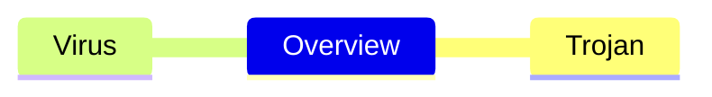

# Ôn tập an toàn mạng 

- Trojan: 
    - A piece of malware or virus, attacker install on devices for malicious purposes. 
    - Appear as a legit file.
    - A Trojan horse cannot manifest by itself, the executable (.exe) file should be implemented and the program installed for the Trojan to attack a device’s system.
    - Zoombie computer: attackers have remote control of user computer without the user knowing.
    - Botnet: a network of infected devices.
    - Examples:
        - Backdoor trojan:
            ```mermaid
            sequenceDiagram
                actor User
                actor Attacker
                actor Friend
                User-->>Attacker: I want a 'cracked' game.
                Attacker-->>User: Here you go, have fun :).
                User-->>Friend: 'I have something you don't know'.
                Friend-->>User: 'What is it?'.
                Attacker-->>User: 'But I know :)'.
            ```
        - Ransomeware trojan:
            ```mermaid
            sequenceDiagram
                actor User
                participant Computer
                actor Attacker
                User->>Computer: I want my 'study' folder.
                Computer->>User: Pay $99.99 to unlock.
                User->>Computer: Why?.
                Attacker-->>User: E* sport, to the game :). 
            ```
    - Remote Access Trojan (RAT): 
        - Include 2 files: server, client.
        - Run in background, allow attackers to remote access through specific port.
        - Ex: Back orifice, Girlfriend, Netbus ...
        ```mermaid
        flowchart LR
        a(Attacker) --> Keyboard 
        a --> Monitor
        a --> Storage
        a --> Camera
        a --> Microphone
        a --> ...
        ```
- Keylogger: 
    - Availible in 2 types: hardware, software.
    - Record keyboard typing.
    - Good: monitor children on the internet ...
    - Bad: Steal password.
    - 3 parts:
        - Program: monitor activities.
        - Hook file: record typing, screen capture.
        - Log file: record hook history.
- Trojan coutermeasures:
    - Avoid email from unknown.
    - Update OS.
    - Block unnecessary ports.
    - Use antivirus software.
    