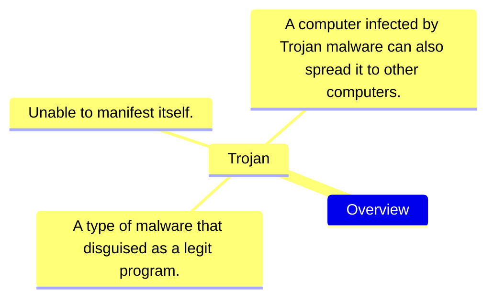

# Ôn tập an toàn mạng 

- Trojan: 
    - A piece of malware or virus, attacker install on devices for malicious purposes. 
    - Appear as a legit file.
- Backdoor trojan:
    ```mermaid
    sequenceDiagram
        actor User
        actor Attacker
        actor Friend
        User-->>Attacker: I want a 'cracked' game.
        Attacker-->>User: Here you go, have fun :).
        User-->>Friend: 'I have something you don't know'.
        Friend-->>User: 'What is it?'.
        Attacker-->>User: 'But I know :)'.
    ```
- Ransomeware trojan:
    ```mermaid
    sequenceDiagram
        actor User
        participant Computer
        actor Attacker
        User->>Computer: I want my 'study' folder.
        Computer->>User: Pay $99.99 to unlock.
        User->>Computer: Why?.
        Attacker-->>User: E* sport, to the game :). 
    ```