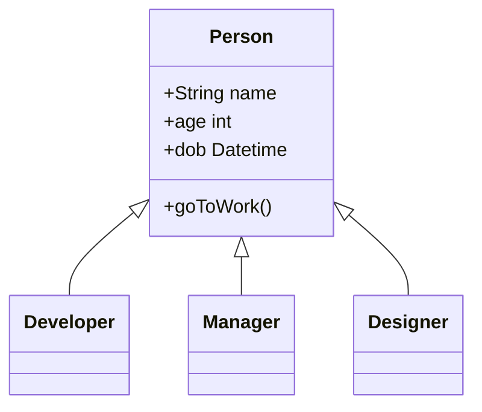
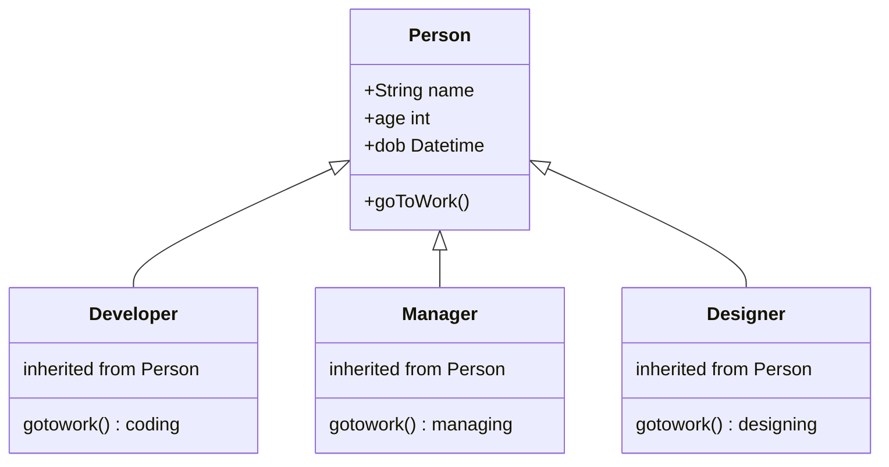

# Object Oriented Programming
## *4 pilars*
- Abstract: trừu tượng hóa, mô hình hóa
    - Class: prototype, khuôn mẫu
    - Object: thực thể
- Encapsulation: đóng gói
    - Access modifier: private, public, protected
    - Field, method
    - Cho thấy thứ cần thấy
- Inheritance: kế thừa

- Polymophism: đa hình  
      - Overwrite các function

## *S.O.L.I.D*
- Make code more readable.
- Stand for:
    - Single Resposibility: 
      - Mỗi class chỉ làm đúng việc của nó