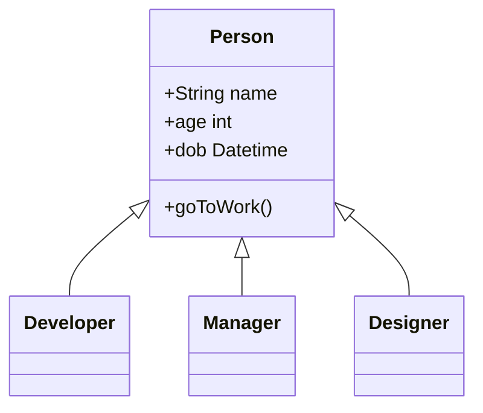
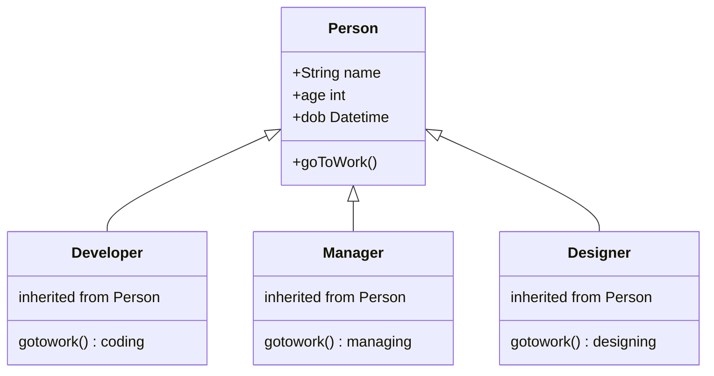

# Object Oriented Programming
## *4 pilars*
- Abstract: trừu tượng hóa, mô hình hóa
    - Class: prototype, khuôn mẫu
    - Object: thực thể
- Encapsulation: đóng gói
    - Access modifier: private, public, protected
    - Field, method
    - Cho thấy thứ cần thấy
- Inheritance: kế thừa



- Polymophism: đa hình  
      - Overwrite các function



## *S.O.L.I.D*
- Make code more readable.
- Stand for:
    - Single Resposibility: 
      - Mỗi class chỉ làm đúng việc của nó.
      - Chia thành nhiều class (micro services).

      ```mermaid
      flowchart LR
      user("User")
      service1("PostService")
      service2("FriendService")
      service3("MessageService")
      user --> service1
      user --> service2
      user --> service3
      ```
    - Open-Closed: open for **extension** but close for **modification**
      - Use ***Decorator Design Patten***
      ```Java
      public class A implements FeatureInterface {
            public void doSomething() {
                  // Your code here
            }
      }
      ```
      ```Java
      public class B implements FeatureInterface {
            protected FeatureInterface a;
            protected B(FeatureInterface a) {
                  this.a = a;
            }

            public void doSomething() {
                  this.a.doSomething();
            }
      }
      ```
      - Dependency Injection: trong runtime, có thể chọn khi nào dùng **class A**, khi nào dùng **class B**
    - Liskov Substituition: 
      - Class con có khả năng thay thể được class cha.
      - Không làm mất đi tính đúng.

      ```mermaid
      classDiagram
            SavingAccount <|-- WithdrawableAccount
            SavingAccount <|-- NonWithdrawableAccount
            SavingAccount: +withDraw(amt)

            class WithdrawableAccount{
                  +withDraw(amt)
            }
            class NonWithdrawableAccount{
                  +deposit(amt)
            }

            WithdrawableAccount  <|-- GeneralAccount
            class GeneralAccount{
                  +withDraw(amt)
            }

            NonWithdrawableAccount  <|-- KidsAccount
            class KidsAccount{
                  +withDraw(amt)
            }
      ```
    - Interface Segretation: không nên để 1 interface quá lớn 
   ```c#
   namespace RepositoryPattern.Interfaces 
   {
      public partial interface IReadRespository<T> where T : class 
      {
            // Read method
      }
   }

   namespace RepositoryPattern.Interfaces 
   {
      public partial interface IWriteRespository<T> where T : class 
      {
            // Write method
      }
   }

   namespace RepositoryPattern.Interfaces 
   {
      public partial interface IDeleteRespository<T> where T : class 
      {
            // Delete method
      }
   }

   namespace RepositoryPattern.Interfaces 
   {
      public interface IRespository<T> : IReadRepository<T>, IWriteRepository<T>, IDeleteRepository<T> // Use as many interfaces as need
   }
   ```
   - Dependency Inversion: 
      - Các class không nên depend lẫn nhau.
      - Chỉ nên depend theo interface.
     ```java
     public class BlogService {
      private readonly IRepository<Blog> repo;
      protected BlogService(IRepository<Blog> repo) {
            this.repo = repo;
      }

      public void doSomething() {
            this.repo
      }
     }
     ```
     ```mermaid
      flowchart LR
            id1([SERVICE])
            id2([REPOSITORY])
            id3([IREPOSITORY])
            id1 ---- id3
            id2 ---- id3
     ```